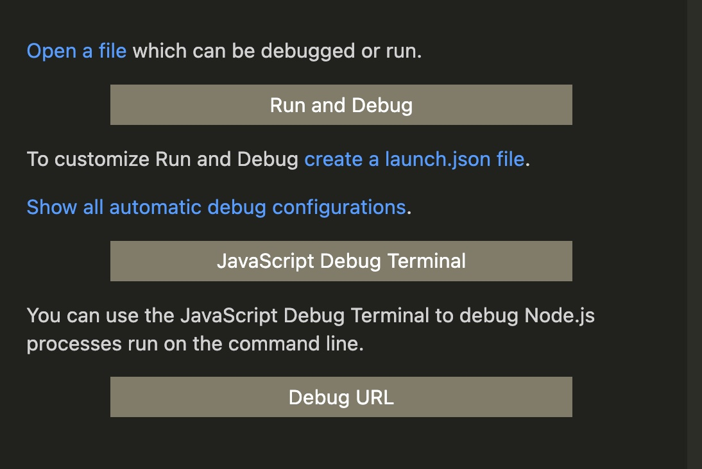

# Debugging with VS Code and Cypress

There are definitely improvements that could be made to this workflow but it works for me. There are other, possibly better, ways of achieving the same result in a different way but this is the way I do it.
TLDR: Run the app in VS Code’s internal Javascript Debug Terminal and Cypress in a different terminal

1. Unless your project has a launch.json file at its root or you have debug config in your VS Code settings.json when clicking the debug icon (the ▶️ with a 🐞 on it) on the side of VS Code you will be presented with this screen:  
   
2. Select ‘Javascript Debug Terminal’ which should bring up VS Code’s internal terminal, start the app as you would in any other terminal (`script/server`)
   - NB - it is possible to use an external terminal as a debug terminal but I’ve found it to be a little flaky - https://stackoverflow.com/questions/45866398/vscode-how-can-i-use-iterm2-as-my-launch-json-console-externalterminal-on-mac-o
3. The app should run as usual but with the ability to add breakpoints
4. To set up Cypress head to the cypress.json at the root of the project, change the “baseUrl” to “http://localhost:3000”
5. Open another terminal, either in VS Code or an external terminal (this will just have Cypress logs in which I am yet to find value in), in the root of the project
6. run npm run int-test-ui, this should run Cypress and load the Cypress app/UI
7. You now should be able use the debugger whilst running Cypress tests, you can restart the server in the VS Code terminal without having to restart Cypress should you need to.
